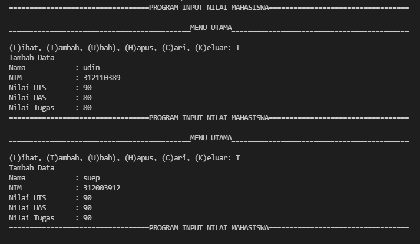
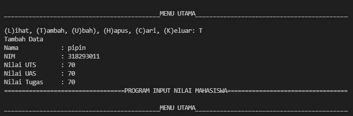
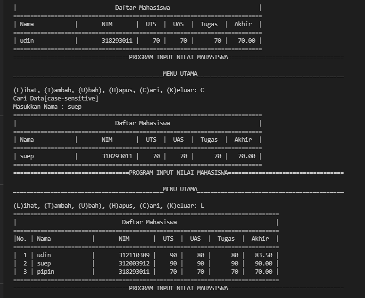

 <p>
### Program ini adalah program untuk Menghitung dan Menampilkan data nilai Mahasiswa dengan  Tampilkan menu pilihan: (Tambah Data, Ubah Data, Hapus Data,Tampilkan Data, Cari Data) Nilai Akhir diambil dari perhitungan 3 komponen nilai (tugas: 30%,uts: 35%, uas: 35%)


## Entry Input Pada Program Ini Adalah : 
<ul>
   <li>Input <b>Nama</b> </li>
   <li>Input <b>Nim</b></li>
   <li>Input <b>NILAI Tugas</b></li>
   <li>Input <b>Nilai Uas</b></li>
   <li>Input <b>Nilai Akhir</b></li>
</ul>
<hr/>


### Disini saya juga menggunakan fungsi list untuk program input pada koding ini, yaitu menggunakan Visual Studi Code. 
### selain itu saya menggunakan perintah while untuk mengulang pertanyaan yang akan diinput 

```javascript
data=[]
while(True):
    nim=input("masukan NIM: ")
    Nama=input("masukaan Nama: ")
    Tugas=input("masukan nilai Tugas: ")
    uts=input("masukan nilai UTS: ")
    uas=input("masukaan nilai UAS: ")
```

### Maka outputnya akan ada pertanyaan seperti di bawah ini :
```javascript
(L)ihat, (T)ambah, (U)bah), (H)apus, (C)ari, (K)eluar:
```

## Untuk menambahkan baris pada tabel. untuk menampilkan karakter bisa ditambahkan tanda (' ') dan untuk menampilkan hasil dari input tidak menggunakan tanda petik. dan untuk perhitungan nilai akhir menggunakan operator aritmatika perkalian dan penjumlahan.
```javascript
elif c.lower() == 'c':
        print("Cari Data[case-sensitive]")
        nama = input("Masukkan Nama : ")
        if nama in x.keys():
            print("="*73)
            print("|                             Daftar Mahasiswa                          |")
            print("="*73)
            print("| Nama            |       NIM       |  UTS  |  UAS  |  Tugas  |  Akhir  |")
            print("="*73)
            print("| {0:15s} | {1:15d} | {2:5d} | {3:5d} | {4:7d} | {5:7.2f} |"
                  .format(nama, nim, uts, uas, tugas, akhir))
            print("="*73)
        else:
            print("Nama {0} Tidak Ditemukan".format(nama))

    elif c.lower() == 'l':
        if x.items():
            print("="*78)
            print("|                               Daftar Mahasiswa                             |")
            print("="*78)
            print("|No. | Nama            |       NIM       |  UTS  |  UAS  |  Tugas  |  Akhir  |")
            print("="*78)
            i = 0
            for z in x.items():
                i += 1
                print("| {no:2d} | {0:15s} | {1:15d} | {2:5d} | {3:5d} | {4:7d} | {5:7.2f} |"
                      .format(z[0][:13], z[1][0], z[1][1], z[1][2], z[1][3], z[1][4], no=i))
            print("=" * 78)
        else:
            print("="*78)
            print("|                               Daftar Mahasiswa                             |")
            print("="*78)
            print("|No. | Nama            |       NIM       |  UTS  |  UAS  |  Tugas  |  Akhir  |")
            print("="*78)
            print("|                                TIDAK ADA DATA                              |")
            print("="*78)

    elif c. lower() == 'k':
        break
```


### HASIL INPUT :
 <p>
 <p>

### HASIL OUTPUT :
 <p>